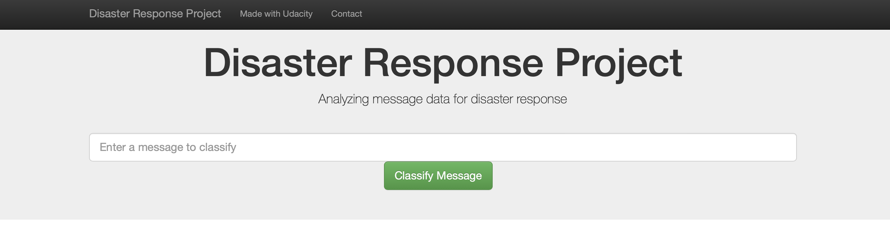
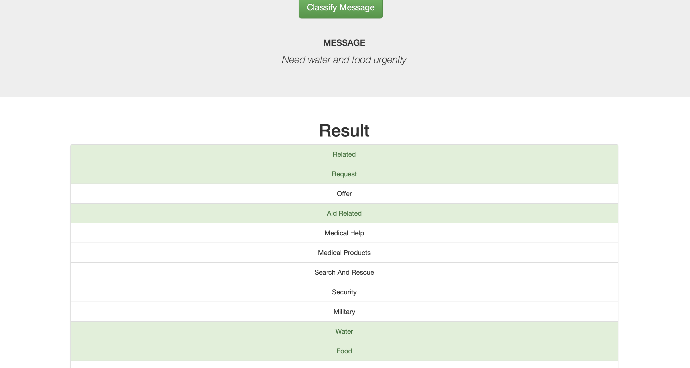
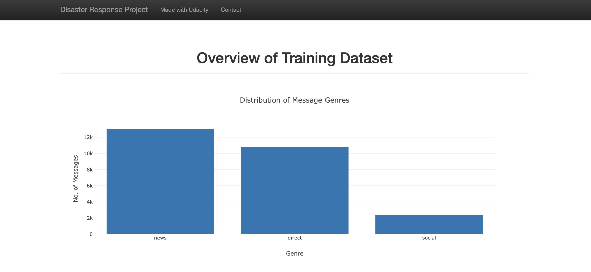
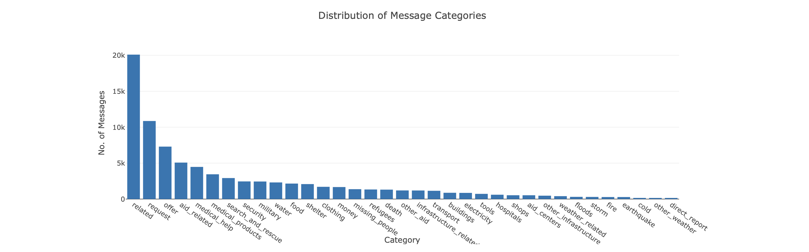
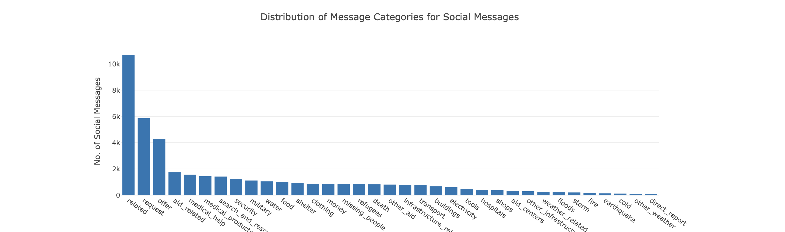

# Disaster Response Pipeline Project

## Introduction

This project is part of the Data Scientist Nanodegree Program by Udacity in collaboration with Figure Eight.

We have been provided with a data set containing real messages that were sent during disaster events. The objective is to create a machine learning pipeline to categorize these events so that we can send the messages to an appropriate disaster relief agency.

The project includes a web app where an emergency worker can input a new message and get classification results in several categories. The web app also displays visualizations of the data.

## Project Files Structure

```md
.
├── LICENSE.txt
├── README.md
├── app
│   ├── run.py
│   └── templates
│       ├── go.html
│       └── master.html
├── data
│   ├── disaster_categories.csv
│   ├── disaster_messages.csv
│   ├── disaster_response.db
│   └── process_data.py
├── models
│   └── train_classifier.py
└── screenshots
    ├── classify_msg.png
    ├── header.png
    ├── vis1.png
    ├── vis2.png
    └── vis3.png
```

## About the files

templates/* -- html files for web app

process_data.py -- Extract Train Load (ETL) pipeline used for data cleaning, feature extraction, and storing data in a SQLite database.

train_classifier.py -- An ML pipeline that loads data, trains a model, and saves the trained model as a pickle file for later use

run.py -- This file is used to launch the Flask web app used to classify disaster messages and showcase some visualisations.

## Steps to execute the files

1. Run the following commands in the project's root directory to set up the database and model.

    - To run ETL pipeline that cleans data and stores in database
        `python data/process_data.py data/disaster_messages.csv data/disaster_categories.csv data/disaster_response.db`
    - To run ML pipeline that trains classifier and saves
        `python models/train_classifier.py ..data/disaster_response.db ..models/classifier.sav`

2. Run the following command in the app's directory to run the web app.
    `python run.py`

3. Go to http://0.0.0.0:3001/

## Screenshots










